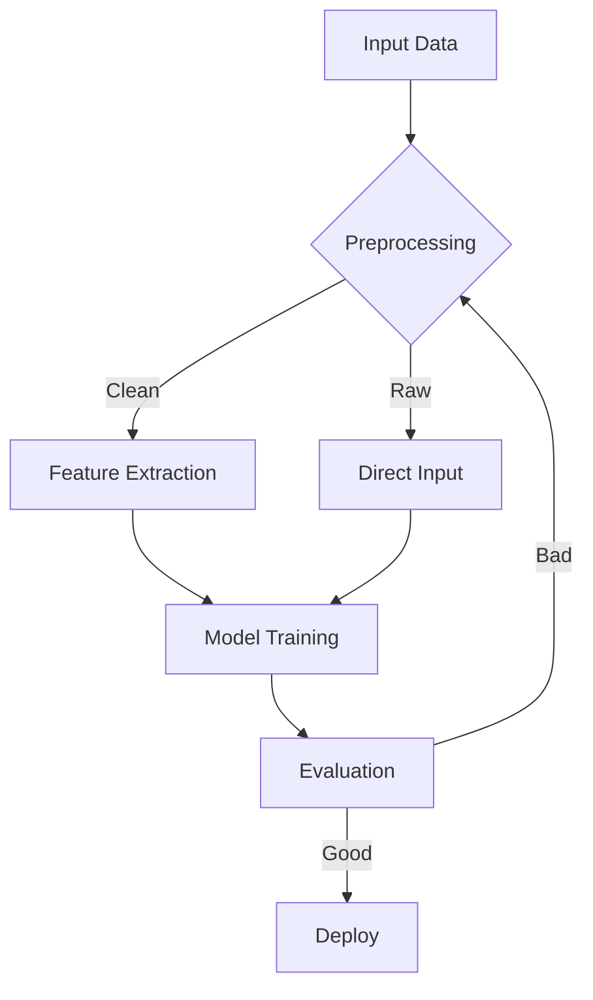
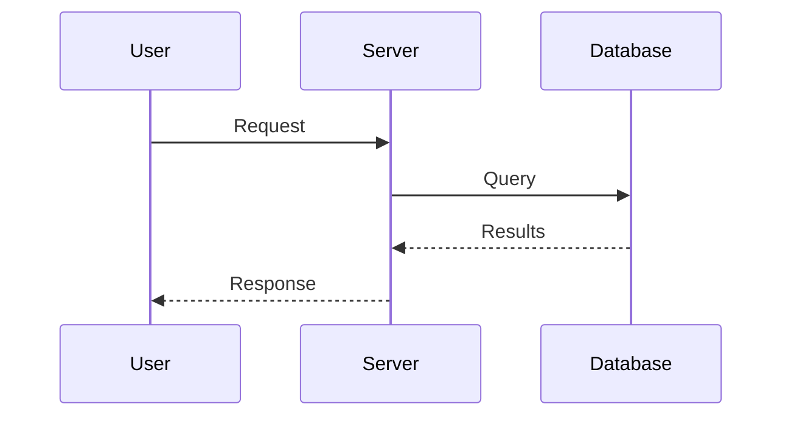
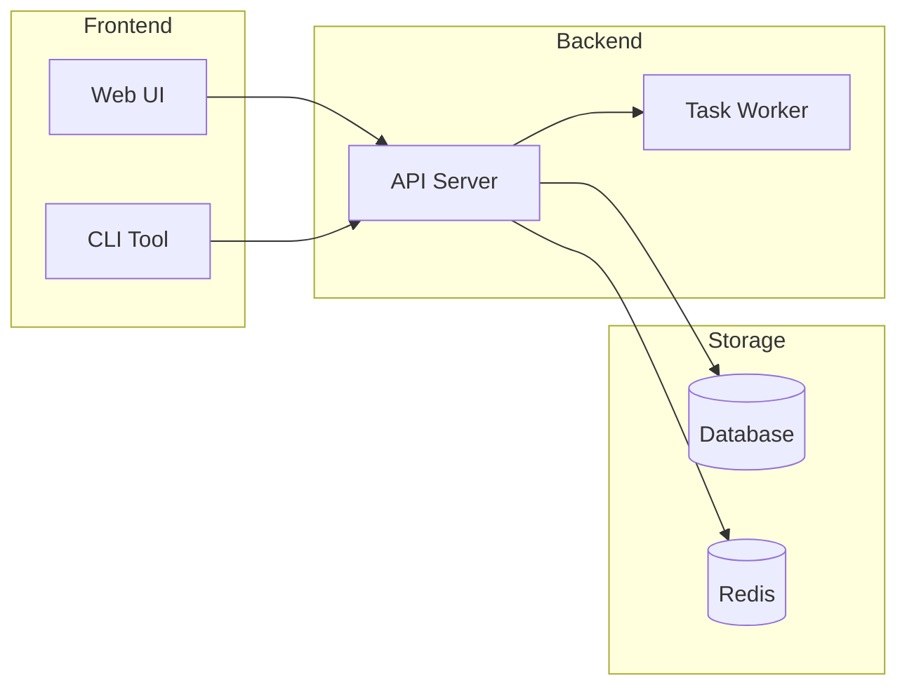

# Mermaid 制图技能

Mermaid 是 LLM 生成成功率最高的图表语法，token 效率比 XML/JSON 格式高约 24 倍。

## 适用场景

- 流程图 (flowchart)
- 序列图 (sequenceDiagram)
- 类图 (classDiagram)
- 状态图 (stateDiagram-v2)
- 甘特图 (gantt)
- 思维导图 (mindmap)

## 渲染方式

```bash
# 安装 (首次)
npm install -g @mermaid-js/mermaid-cli

# 渲染
mmdc -i figures/diagram.mmd -o figures/diagram.png -w 1200 -H 800 --backgroundColor white
```

## 代码模板

### 流程图



### 序列图



### 架构图



## 执行流程

1. 将 Mermaid 代码写入 `figures/xxx.mmd`
2. 执行：`mmdc -i figures/xxx.mmd -o figures/xxx.png -w 1200 --backgroundColor white`
3. 验证输出文件存在

## vs D2 选择

| 特性 | Mermaid | D2 |
|------|---------|-----|
| LLM 生成成功率 | 更高 | 较高 |
| 视觉质量 | 良好 | 更好 |
| Token 效率 | 最优 | 良好 |
| GitHub 渲染 | 原生支持 | 不支持 |
| 适合场景 | 流程图、序列图 | 复杂架构图 |

**建议**：简单图用 Mermaid，复杂嵌套架构图用 D2 (DiagramGen)。
